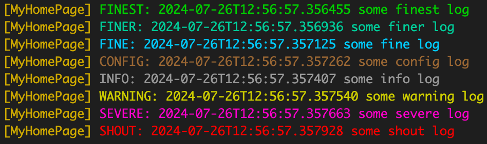

# TheLogger

[](https://github.com/nesquikm/the_logger/actions/workflows/analyze-and-test.yaml)

A modular logging library for Flutter.

## Features



- Colorful console logging
- Database logging
- Custom logging
- Sessions
- Exports logs to compressed file
- Flexible logs filtering and retaining strategies

## Getting started

To use this package, add `the_logger` and `logging` as a [dependency in your pubspec.yaml file](https://flutter.dev/docs/development/packages-and-plugins/using-packages).

## Usage

Import the packages:

```dart
import 'package:the_logger/the_logger.dart';
import 'package:logging/logging.dart';
```

Get an instance of the logger and initialize it:

```dart
await TheLogger.i().init();
```

And then you can use it by calling [Logger](https://pub.dev/packages/logging) methods:

```dart
final _log = Logger('MyHomePage');
_log.finest('some finest log');
```

TheLogger is a singleton, so you can get the same instance anywhere in your app:

```dart
final instance = TheLogger.i();
```

This should be done as early as possible in your app, and only once. Before calling `init()` second time, you should call `dispose()` method.

You can define retain strategy for logs. For example:

```dart
TheLogger.i().init(retainStrategy: {
  Level.ALL:      200,  // ALL records will be deleted after 200 sessions
  Level.INFO:     100,  // records with INFO and higher level retained for 300 sessions
  Level.SEVERE:   50,   // records with SEVERE and higher level retained for 350 sessions
});
```

Logs are separated by sessions. By default, TheLogger starts a new session every time you call `init()` method (but you can change this behavior by passing `startNewSession: false` to `init()` method):

```dart
TheLogger.i().init(startNewSession: false);
```

You can start a new session manually by calling:

```dart
TheLogger.i().startSession();
```

`startSession()` can be called multiple times, for example when app resumes from background (see example).

There is a way to append session start log message with custom string (for example, you can add application version) or change session start log message level:

```dart
TheLogger.i().init(
  sessionStartExtra: $appVersion,
  sessionStartLevel: Level.FINE, // default is Level.INFO
);
```

To enable or disable console logging and whethe to store logs in database, use:

```dart
TheLogger.i().init(
  consoleLogger: false,
  dbLogger: false,
);
```

There is a way to capture logs that will be sent to console by providing callback function `consoleLoggerCallback`:

```dart
TheLogger.i().init(
  consoleLoggerCallback: (
      String message, {
      DateTime? time,
      int? sequenceNumber,
      int level = 0,
      String name = '',
      Zone? zone,
      Object? error,
      StackTrace? stackTrace,
  ) {
    // do something with the record
  },
);
```

You can add custom loggers (for example for sending logs to server):

```dart
TheLogger.i().init(
  customLoggers: [
    remoteLogger,
    anotherLogger,
  ],
);
```

To write all logs to compressed file call `writeAllLogsToJson` method:

```dart
final filePath = await TheLogger.i().writeAllLogsToJson();
```

This method returns a path to the file with logs. You can send this file to server, ask user to send it to you, or do whatever you want with it.

For debugging purposes, you can get all logs from database and clear all logs from database:

```dart
final logsAsString = await TheLogger.i().getAllLogsAsString();
final logsAsList = await TheLogger.i().getAllLogs();
final logsAsAsMaps = await TheLogger.i().getAllLogsAsMaps();
final logsAsAsMaps = await TheLogger.i().clearAllLogs();
```

## Testing

This package includes several unit tests for its features. To run the tests, use the following command:

```bash
flutter test
```
